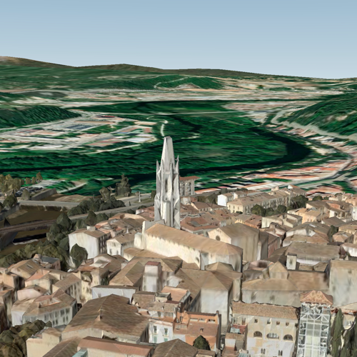

# Explore scenes in flyover AR

Use augmented reality (AR) to quickly explore a scene more naturally than you could with a touch or mouse interface.



## Use case

You can use AR to drop into an area and visualize information, like a proposed development or a historical model of a city. You could use flyover AR to explore a city by walking through it virtually.

## How to use the sample

When you open the sample, you'll be viewing the scene from above. You can walk around, using your device as a window into the scene. Try moving vertically to get closer to the ground.

## How it works

1. Create the `ArcGISARView` and add it to the view.
2. Create the scene, add content, then display it.
3. When the content you want to view loads, get its center point and use that to create the origin camera for the AR view. Note that the altitude should be set so that all scene content is visible. For a city, a good value might be a bit higher than the tallest building. The sample uses 250 meters in the absence of tall buildings in the sample data.
4. Set the translation factor so that you can move through the scene easily. With a translation factor of 1000, you will move 1000 feet in the scene for every foot you move the physical device.
5. Set the space effect to `SpaceEffect::Stars` and atmosphere effect to `AtmosphereEffect::Realistic` to create an immersive experience.

## Relevant API

* ArcGISARView
* SceneView

## About the data

This sample uses a sample [integrated mesh layer](https://www.arcgis.com/home/item.html?id=dbc72b3ebb024c848d89a42fe6387a1b) provided by [Vricon](https://www.vricon.com/). The integrated mesh layer shows an area around the US-Mexico border.

The [world elevation service](https://elevation3d.arcgis.com/arcgis/rest/services/WorldElevation3D/Terrain3D/ImageServer) is used to show terrain while the integrated mesh layer loads.

## Additional information

**Flyover AR** is one of three main patterns for working with geographic information in augmented reality.

#### Clone the toolkit repo - Required for AR samples

Change directory into your locally cloned samples repo and then use `git clone` to get a copy of the [ArcGIS Runtime Toolkit - Qt](https://github.com/Esri/arcgis-runtime-toolkit-qt.git).

```
# Change directory to the clone of the samples repository
# Clone the toolkit repository into the current directory in terminal
$ cd /arcgis-runtime-samples-qt
$ git clone https://github.com/Esri/arcgis-runtime-toolkit-qt.git
```

Cloning the toolkit in this location will allow for the samples to automatically pick it up. If you wish to place the toolkit in another location, you will need to update the samples project file accordingly to locate the necessary .pri file.

For more information on the Augmented Reality (AR) toolkit, including the steps required to deploy to Android and iOS, see [the AR README on GitHub](https://github.com/Esri/arcgis-runtime-toolkit-qt/blob/master/augmentedreality/README.md).

## Tags

augmented reality, bird's eye, birds-eye-view, fly over, flyover, mixed reality, translation factor
