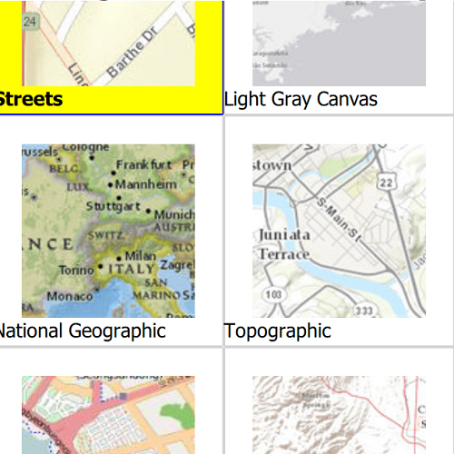

# Show organization basemaps

Connect to Portal to give users access to their organization's basemaps.

## Use case

Organizational basemaps are a Portal feature allowing organizations to specify basemaps for use throughout the organization. Customers expect that they will have access to their organization's standard basemap set when they connect to a Portal. Organizational basemaps are useful when certain basemaps are particularly relevant to the organization, or if the organization wants to make premium basemap content available to their workers.

## How to use the sample

You'll be prompted to load a portal anonymously or with a log-in. After you sign in, you'll see thumbnails for these basemaps shown in a picker. Select a basemap to use it in the map.

## How it works

1. The user is prompted to load a portal anonymously or with a log-in.
2. A `Portal` is then loaded - if the user chose to log-in in step 1, this uses a `Credential` of type OAuth.
3. When the app starts, the portal is loaded and if required, the `AuthenticationManager` issues a challenge for the supplied credential type.
4. The user is presented with an `AuthenticationView` which allows them to log-in.
5. After a successful load, get the list of basemaps: `portal::fetchBasemapsAsync()`

## Relevant API

* Portal
* Portal::fetchBasemapsAsync

## Additional information

See [Customize basemaps](https://enterprise.arcgis.com/en/portal/latest/administer/windows/customize-basemaps.htm) in the *Portal for ArcGIS* documentation to learn about customizing the organization's basemap list in a portal.

## Tags

basemap, integration, organization, portal
