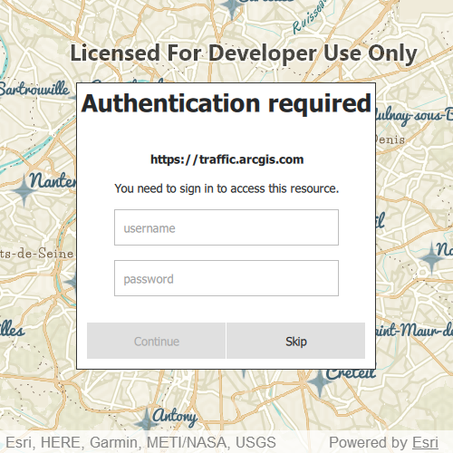

# Token authentication

This sample demonstrates how to access a map service that is secured
with ArcGIS token-based authentication.

## How it works

A map service that is secured with ArcGIS token-based authentication is
added to the map’s operational layers. Next, the `AuthenticationView`
component from the ArcGIS Runtime Toolkit is added to the QML layout,
and its `authenticationManager` property is set to the
`AuthenticationManager` singleton. The `AuthenticationView` handles all
of the authentication challenges that are issued, automatically displays
the appropriate view, and continues the challenge with the user provided
credential. In order to access the `AuthenticationManager` from the QML
side, it must first be registered as a QML type, and then exposed as a
Q\_PROPERTY. When the map loads and attempts to load the secured map
service, a challenge is issued, the `UserCredentialsView` is
automatically displayed by the `AuthenticationView`, and the user can
then provide the username and password for this resource. In this case,
the username is `user1` and the password is also `user1`.
