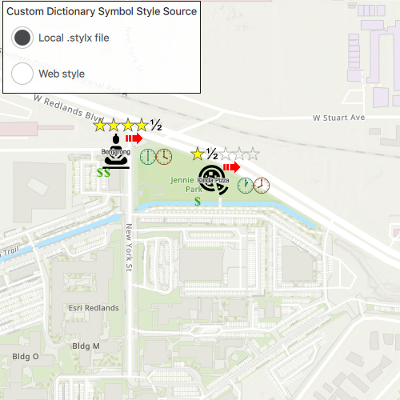

# Custom dictionary style

Use a custom dictionary style created from a web style or local style file (.stylx) to symbolize features using a variety of attribute values.

## Use case

When symbolizing geoelements in your map, you may need to convey several pieces of information with a single symbol. You could try to symbolize such data using a unique value renderer, but as the number of fields and values increases, that approach becomes impractical. With a dictionary renderer you can build each symbol on-the-fly, driven by one or more attribute values, and handle a nearly infinite number of unique combinations.

## How to use the sample

Use the radio buttons to toggle between the dictionary symbols from the web style and style file. Pan and zoom around the map to see the symbology from the chosen dictionary symbol style. The web style and style file are slightly different to each other to give a visual indication of the switch between the two.

## How it works

1. Create a `PortalItem`, referring to a `Portal` and the item ID of the web style.
2. Based on the style selected:
    *  If the web style toggle has been selected, create a new `DictionarySymbolStyle` from the portal item using `new DictionarySymbolStyle(PortalItem *portalItem)`, and load it
    *  If the file style toggle has been selected, create a new `DictionarySymbolStyle` using `DictionarySymbolStyle::createFromFile(const QString &styleFilePath)`
3. Create a new `DictionaryRenderer`, providing the dictionary symbol style.
4. Apply the dictionary renderer to a feature layer using `FeatureLayer::setRenderer(Renderer *renderer)`.
5. Add the feature layer to the map's operational layers using `Map::OperationalLayers::append(Layer* layer)`.

## Relevant API

* DictionaryRenderer
* DictionarySymbolStyle
* Portal
* PortalItem

## About the data

Data used in this sample are from a feature layer showing a subset of [restaurants in Redlands, CA](https://services2.arcgis.com/ZQgQTuoyBrtmoGdP/arcgis/rest/services/Redlands_Restaurants/FeatureServer) hosted as a feature service with attributes for rating, style, health score, and open hours.

The feature layer is symbolized using a dictionary renderer that displays a single symbol for all of these variables. The renderer uses symbols from a custom restaurant dictionary style created from a [stylx file](https://arcgis.com/home/item.html?id=751138a2e0844e06853522d54103222a) and a [web style](https://arcgis.com/home/item.html?id=adee951477014ec68d7cf0ea0579c800), available as items from ArcGIS Online, to show unique symbols based on several feature attributes. The symbols it contains were created using ArcGIS Pro. The logic used to apply the symbols comes from an Arcade script embedded in the stylx file (which is a SQLite database), along with a JSON string that defines expected attribute names and configuration properties.

## Additional information

For information about creating your own custom dictionary style, see the open source [dictionary renderer toolkit](https://esriurl.com/DictionaryToolkit) on *GitHub*.

## Tags

dictionary, military, portal, portal item, renderer, style, stylx, unique value, visualization
