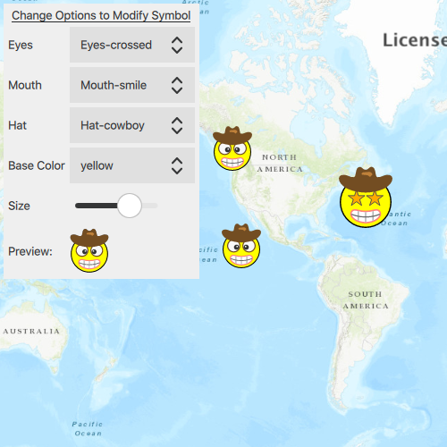

# Read symbols from a mobile style

Open a mobile style (.stylx) and read its contents. Combine several symbols from the style into a single multilayer point symbol, then use it to display graphics in the map view.

## Use case

Multilayer symbols provide the ability to create much more complex and interesting symbology for GeoElements. While these symbols can be created from scratch, a more convenient workflow is to author them using ArcGIS Pro and store them in a mobile style file (.stylx). ArcGIS Runtime can read symbols from a mobile style, and you can modify and combine them as needed in your app.

## How to use the sample

- Select symbols from each combo box to create a face emoji. A preview of the symbol is updated as you make selections.
- You can optionally select a new color from the drop down list and set the symbol size using the slider.
- Tap the map to create a point graphic that uses the current face symbol.
- Tap the `Clear` button to clear all graphics from the display.

## How it works

1. On startup, read a mobile style file by creating and loading a `SymbolStyle`.
2. Get a list of symbols in the style by calling `SymbolStyle::searchSymbols`.
3. Display the resulting `SymbolStyleSearchResultListModel` inside a series of ComboBoxes.
4. When symbol selections change, create a new multilayer symbol by passing the keys for the selected symbols into `SymbolStyle::fetchSymbol`.
5. Iterate through the symbol layers and color lock all symbol layers except the base layer and update the current symbol preview image by calling `Symbol::createSwatch`.
6. Create graphics symbolized with the current symbol when the user taps the map view.

## Relevant API

* MultilayerPointSymbol
* Symbol.createSwatch
* SymbolLayer
* SymbolStyle
* SymbolStyle::searchSymbols
* SymbolStyle::fetchSymbol
* SymbolStyleSearchResultListModel
* SymbolStyleSearchResult
* SymbolStyleSearchParameters

## Offline Data

A mobile style file (created using ArcGIS Pro) provides the symbols used by the sample.

Link | Local Location
---------|-------|
|[Emoji mobile style](https://www.arcgis.com/home/item.html?id=1bd036f221f54a99abc9e46ff3511cbf)| `<userhome>`/ArcGIS/Runtime/Data/style/emoji-mobile.stylx |

## Tags

advanced symbology, multilayer, mobile style, stylx
