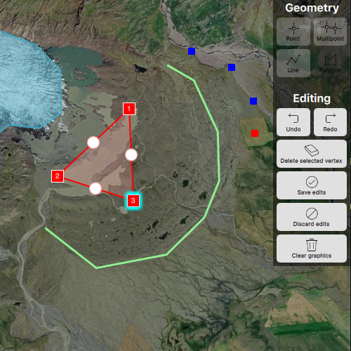

# Sketch on map

This sample demonstrates how to use the Sketch Editor to edit or sketch a new point, line, or polygon geometry on to a map.

## Use case

A field worker could annotate features of interest on a map (via the GUI) such as location of dwellings (marked as points), geological features (polylines), or areas of glaciation (polygons).

## How to use the sample

Choose which geometry type to sketch from one of the available buttons. Choose from points, multipoints, polylines, and polygons.

Add points or vertices by tapping on the map. You can edit individual points by tapping to select the point, then dragging it to a new location or double tapping to delete it.

Use the control panel to undo or redo changes made to the sketch, save the sketch to the graphics overlay, discard the current sketch, or clear the graphics overlay.

## How it works

1. Create a `SketchEditor` component and set it on the map view with `MapView::setSketchEditor`.
2. Call `SketchEditor::start` and pass in a `SketchCreationMode` enum to begin sketching.
3. While sketching is in progress, call `SketchEditor::undo()` or `SketchEditor::redo()` to undo or redo edits respectively.
4. To save the sketch, first check if the sketch is valid with `SketchEditor::isSketchValid()`. If it is, create a graphic using `SketchEditor::geometry()` and add it to the map view's `GraphicsOverlay`.
5. Call `SketchEditor::stop()` to stop sketching.

## Relevant API

* Geometry
* Graphic
* GraphicsOverlay
* MapView
* SketchCreationMode
* SketchEditor

## Tags

draw, edit
