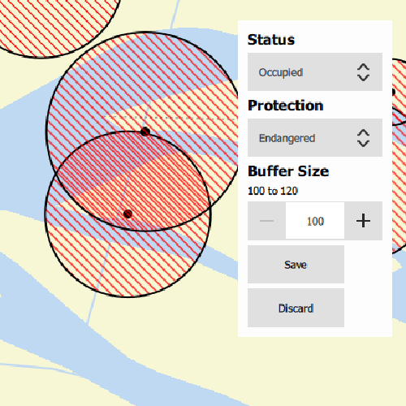

# Add features with contingent values

Create and add features whose attribute values statisfy a predefined set of contingencies.

## Use case

Contingent values can be used to simplify entry and validate the integrity of field values being added or edited in a feature by constraining the available entries of one field by a contingent value in another. A field crew working in a sensitive habitat area may be required to stay a certain distance away from occupied bird nests, but the size of that exclusion area differs depending on the bird's level of protection according to presiding laws. Surveyors can add points of bird nests in the work area and their selection of how large the exclusion area is will be contingent on the values in other attribute fields.

## How to use the sample

Click on the map to add a new nest feature. Fill in the attribute values for each field. Notice how different values are available depending on the values of preceeding fields. Click "Save" to save the new nest feature to the map and have its exclusion area appear.

## How it works

1. Create and load a `Geodatabase`.
2. Load the first `GeodatabaseFeatureTable`.
3. Load the `ContingentValuesDefinition` from the feature table.
4. Create a new `FeatureLayer` from the feature table and add it to the map.
5. Instantiate a list of possible values for the initial field in the table.
6. Create a new `Feature` and select a value for its first `Field`.
7. Retrieve the valid contingent values for each field as the user fills out the form.
  i. Create a `ContingentValuesResult` from `GeodatabaseFeatureTable::contingentValuesResult` and pass in the current feature and the target field by name.
  ii. Get a list of valid `ContingentValue`s from `ContingentValuesResult::contingentValuesByFieldGroup` with the name of the relevant field group.
  iii. Loop through the list to create a list of `ContingentCodedValue` names or the minimum and maximum values of a `ContingentRangeValue` depending on the type of `ContingentValue` returned.
8. Validate the new feature's contingent values by creating a list of `ContingencyConstrantViolation`s by passing the new feature to `GeodatabaseFeatureTable::validateContingencyConstraints`. If the list is empty, then it is valid and can be saved to the map.

## Relevant API

* ContingencyConstraintViolation
* ContingentValuesDefinition
* ContingentValuesResult
* ContingentCodedValue
* ContingentRangeValue
* Geodatabase
* GeodatabaseFeatureTable

## Offline Data

To set up the sample's offline data, see the [Use offline data in the samples](https://github.com/Esri/arcgis-runtime-samples-qt#use-offline-data-in-the-samples) section of the Qt Samples repository overview.

Link | Local Location
---------|-------|
|[Contingent Values Bird Nests](https://www.arcgis.com/home/item.html?id=e12b54ea799f4606a2712157cf9f6e41)| `<userhome>`/ArcGIS/Runtime/Data/geodatabase/ContingentValuesBirdNests.geodatabase |

## About the data

The geodatabase contains birds nests in the Filmore area, defined with contingent values. Each feature contains information about its status, protection, and buffer size.

## Tags

contingent values, contingent coded values, feature table, geodatabase
