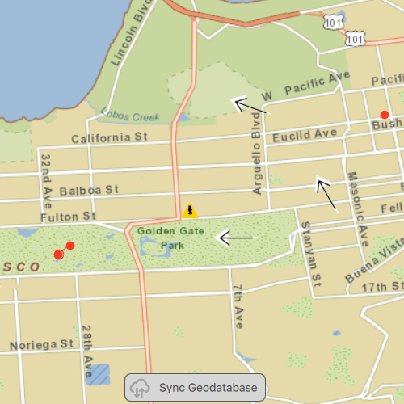

#Edit and sync features

This sample demonstrates how to generate an offline mobile geodatabase from a feature service, edit the feature's geometry while disconnected, and synchronize the local edits back to a feature service.

##How it works
Pan and zoom into the desired area, making sure the area you want to take offline is within the red rectangle. Tap on the Generate Geodatabase button, and this will call `generateGeodatabase`, which will return a `GenerateGeodatabaseJob`. The job must be started manually, and once started can be canceled at anytime. Once the job completes successfully, a `FeatureLayer` is created with the output `FeatureTable` (which is obtained from the result `Geodatabase`), and the layer is added to the `Map`. After the offline layer is displayed, you can select a feature by tapping on it, and move it to a new location by tapping anywhere on the map. When there has been a successful edit, the sync button becomes enabled. This button will synchronize the local edits that have been made in the mobile geodatabase with the remote feature service. Click the sync button, and this will call `syncGeodatabase`, passing in the `SyncGeodatabaseParameters` and the `Geodatabase`. Similar to the generate process, this will return a job (`SyncGeodatabaseJob`), which must be started manually. Once the job completes successfully, the local edits have been synchronized with the feature service.

##Features
- MapView
- Map
- Basemap
- ArcGISTiledLayer
- TileCache
- FeatureLayer
- FeatureTable
- GeodatabaseSyncTask
- GenerateGeodatabaseJob
- GenerateGeodatabaseParameters
- SyncGeodatabaseJob
- SyncGeodatabaseParameters
- GenerateLayerOption
- SyncLayerOption

##Offline Data
Read more about how to set up the sample's offline data [here](http://links.esri.com/ArcGISRuntimeQtSamples).

Link | Local Location
---------|-------|
|[San Francisco Streets TPK](https://www.arcgis.com/home/item.html?id=3f1bbf0ec70b409a975f5c91f363fe7d)| `<userhome>`/ArcGIS/Runtime/Data/tpk/SanFrancisco.tpk |
