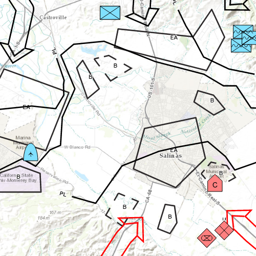

# Feature layer (dictionary renderer)

Convert features into graphics to show them with mil2525d symbols.

## Use case

A dictionary renderer uses a style file along with a rule engine to display advanced symbology.
This is useful for displaying features using precise military symbology.

## How to use the sample

Pan and zoom around the map. Observe the displayed military symbology on the map.

## How it works

1. Create a `Geodatabase` using `Geodatabase(geodatabasePath)`.
2. Load the geodatabase asynchronously using `Geodatabase::load()`.
3. Instantiate a `DictionarySymbolStyle`  using `DictionarySymbolStyle::createFromFile(stylePath)`.
4. Wait for geodatabase to completely load by connecting to `Geodatabase::loadStatusChanged` signal.
5. Cycle through each `GeodatabaseFeatureTable` from the geodatabase using `Geodatabase::geodatabaseFeatureTables()`.
6. Create a `FeatureLayer` from each table within the geodatabase using `FeatureLayer(GeodatabaseFeatureTable)`.
7. Load the feature layer asynchronously with `FeatureLayer::load()`.
8. Wait for each layer to load using `FeatureLayer::loadStatusChanged`.
9. After the last layer has loaded, then create a new `Envelope` from a union of the extents of all layers.
   * Set the envelope to be the `Viewpoint` of the map view using `MapView::setViewpointGeometryAsync(Envelope)`.
10. Add the feature layer to map using `Map::operationalLayers()->append(FeatureLayer)`.
11. Create `DictionaryRenderer(DictionarySymbolStyle)` and attach to the feature layer using `FeatureLayer::setRenderer(DictionaryRenderer)`.

## Relevant API

* DictionaryRenderer
* DictionarySymbolStyle

## Offline Data

Read more about how to set up the sample's offline data [here](https://github.com/Esri/arcgis-runtime-samples-qt#use-offline-data-in-the-samples).

Link | Local Location
---------|-------|
|[Mil2525d Stylx File](https://www.arcgis.com/home/item.html?id=c78b149a1d52414682c86a5feeb13d30)| `<userhome>`/ArcGIS/Runtime/Data/styles/arcade_style/mil2525d.stylx |
|[Military Overlay geodatabase](https://www.arcgis.com/home/item.html?id=e0d41b4b409a49a5a7ba11939d8535dc)| `<userhome>`/ArcGIS/Runtime/Data/geodatabase/militaryoverlay.geodatabase |

## Tags

military, symbol
