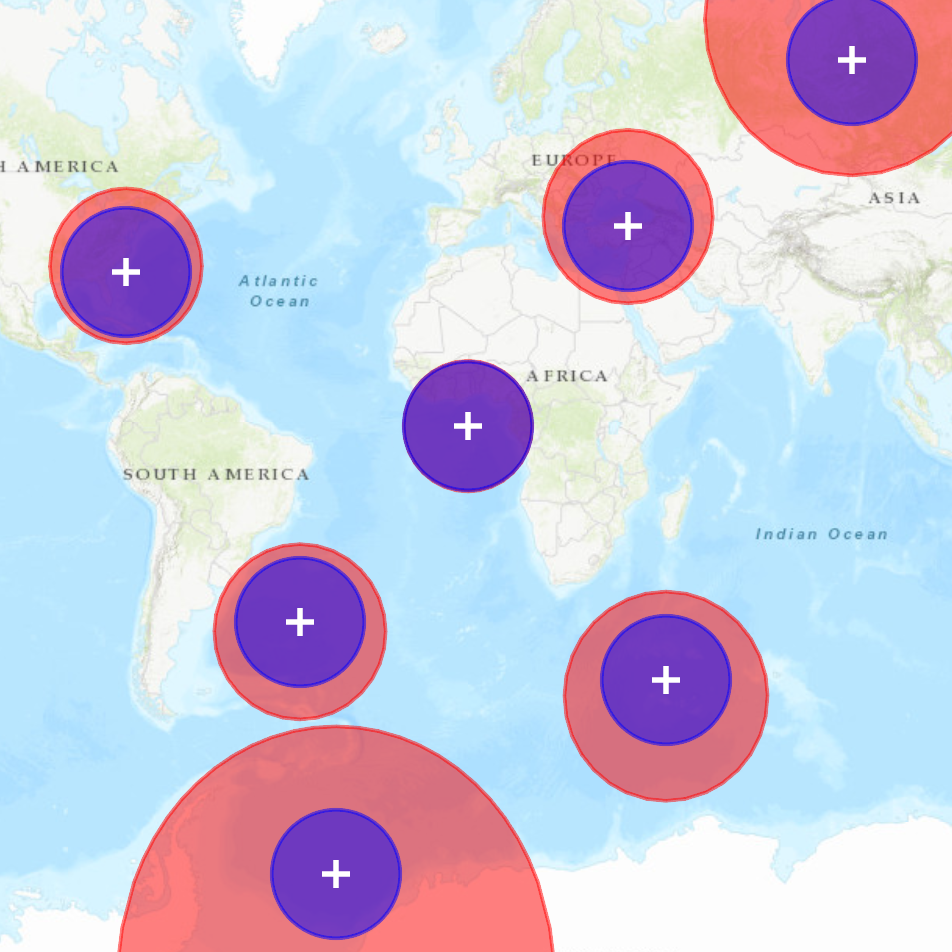

# Buffer

This sample demonstrates how to use GeometryEngine::buffer to create polygons from a map location and linear distance (radius). For each input location, the sample creates two buffer polygons (using the same distance) and displays them on the map using different symbols. One polygon is calculated using the planar (flat) coordinate space of the map's spatial reference. The other is created using a geodesic technique that considers the curved shape of the Earth's surface, and therefore provides a more accurate representation. Distortion in the map increases as you move away from the standard parallels of the spatial reference's projection. This map is in Web Mercator so areas near the equator are the most accurate. As you move the buffer location north or south from that line, you'll see a greater difference in the polygon size and shape.

Creating buffers is a core concept in GIS as it allows for proximity analysis to find geographic features contained within a polygon. For example, suppose you wanted to know how many resturants are within a short walking distance of your home. The first step in this proximity analysis would be to generate a buffer polygon of a certain distance (say 1 mile) around your house. If you are using planar buffers, make sure that the input locations and distance are suited to the spatial reference you're using. Remember that you can also create your buffers using geodesic and then project them to the spatial reference you need for display or analysis.

## How to use the sample
1. Tap on the map.
2. A planar and a geodesic buffer will be created at the tap location using the distance (miles) specified in the text box.
3. Continue tapping to create additional buffers. Notice that buffers closer to the equator appear similar in size. As you move north or south from the equator, however, the geodesic polygons become much larger. Geodesic polygons are in fact a better representation of the true shape and size of the buffer.
4. Click Clear to remove all buffers and start again.

## How it works
The map point for a tap on the display is captured and the buffer distance entered (in miles) is converted to meters. The static method `GeometryEngine::buffer` is called to create a planar buffer polygon from the map location and distance. Another static method, `GeometryEngine::bufferGeodetic is called to create a geodesic buffer polygon using the same inputs. The polygon results (and tap location) are displayed in the map view with different symbols in order to highlight the difference between the buffer techniques due to the spatial reference used in the planar calculation.

## Relevant API
- GeometryEngine::buffer
- GeometryEngine::bufferGeodesic
- GraphicsOverlay

## Tags
Analysis, Buffer, GeometryEngine

## Additional Information
For more details on how the buffer analysis works, please see the ArcGIS Pro [documentation](https://pro.arcgis.com/en/pro-app/tool-reference/analysis/how-buffer-analysis-works.htm).
