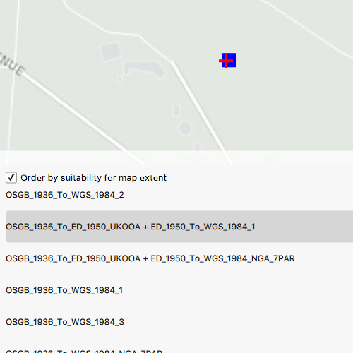

# List transformations by suitability

Transformations (sometimes known as datum or geographic transformations) are used when projecting data from one spatial reference to another, when there is a difference in the underlying datum of the spatial references. Transformations can be mathematically defined by specific equations (equation-based transformations), or may rely on external supporting files (grid-based transformations). Choosing the most appropriate transformation for a situation can ensure the best possible accuracy for this operation. Some users familiar with transformations may wish to control which transformation is used in an operation.

This sample demonstrates how to use the TransformationCatalog to get a list of available DatumTransformations that can be used to project a Geometry between two different SpatialReferences, and how to use one of the transformations to perform the GeometryEngine.project operation. The TransformationCatalog is also used to set the location of files upon which grid-based transformations depend, and to find the default transformation used for the two SpatialReferences.

## How it works
The sample sets the location of projection engine data on the device by calling `TransformationCatalog::setProjectionEngineDirectory`. If the directory is not accessible, an error is reported.

The list of `DatumTransformations` is created by calling `TransformationsCatalog::transformationsBySuitability`, passing in the `SpatialReference` of the original Geometry (the input spatial reference) and that of the `Map` (the output spatial reference). Depending on the state of a check box, the current visible extent of the map is used to sort the list by suitability.

When the user taps on a transformation in the list, the selected transformation is used to reproject a `Point`. The `Graphic's` geometry is then updated with the new `Point`. If the selected transformation is not usable (has missing grid files) then an error is displayed.

## Features
- TransformationCatalog
- DatumTransformation
- GeographicTransformation
- GeographicTransformationStep
- GeometryEngine

## Provision your device
This sample can be used with or without provisioning projection engine data to your device. If you do not provision data, a limited number of transformations will be available to you.

To download projection engine data to your device:
1. Log in to the ArcGIS for Developers site using your Developer account.
2. In the Dashboard page, click 'Download APIs and SDKs'.
3. Click the download button next to `ArcGIS Runtime Coordinate System Data 100.x` to download projection engine data to your computer.
4. Unzip the downloaded data on your computer.
5. Create an `~/ArcGIS/Runtime/Data/PEData` directory on your device and copy the files to this directory.
