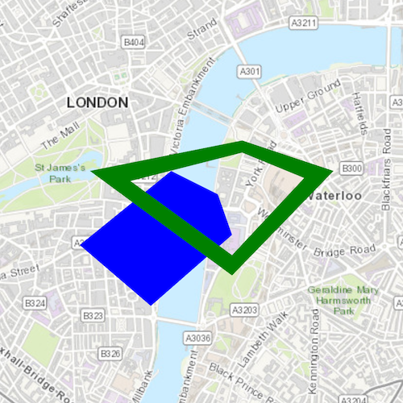

# Spatial operations

This sample demonstrates how to perform spatial operations on geometries
using the GeometryEngine. Spatial operations allow you to perform
spatial analysis between two geometries. For example, you can union
(combine) two geometries together or find the areas of two geometries
that intersect. For example, if you had a polygon representing rivers
and another polygon representing counties, you could find the rivers
that intersect a given county.

## How to use the sample

The sample provides an option to select a geometry operation. When you
choose a geometry operation, the application performs this operation
between the overlapping polygons and applies the result to the
geometries.

## How it works

The sample creates two overlapping polygons using the `PolygonBuilder`
class and adds them as graphics to a `GraphicsOverlay`. These polygons
are used for performing all the spatial operations. For each operation,
a method on the `GeometryEngine` is called with the two polygons as
input. The resulting geometry is added as a red colored graphic to the
overlay. The methods used are as follows:

  - `GeometryEngine::union` - This method returns the two geometries
    unioned together as one geometry.
  - `GeometryEngine::difference` - This method returns any part of
    Geometry2 that does not intersect Geometry1.
  - `GeometryEngine::symmetricDifference` - This method returns any part
    of Geometry1 or Geometry2 which do not intersect.
  - `GeometryEngine::intersection` - This method returns the
    intersection of Geometry1 and Geometry2.
