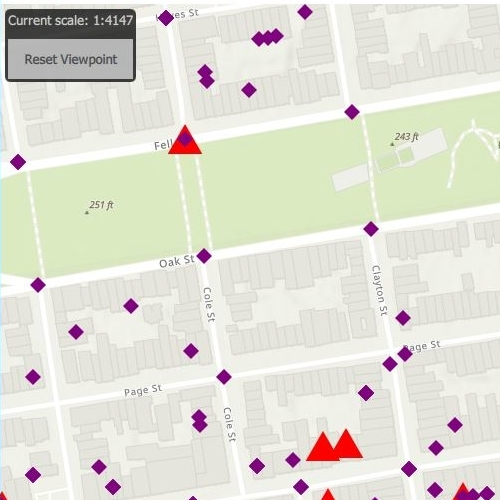

# Apply unique values with alternate symbols

Apply a unique value with alternate symbols at different scales.

## Use case

When a layer is symbolized with unique value symbology, you can specify the visible scale range for each unique value. This is an effective strategy to limit the amount of detailed data at smaller scales without having to make multiple versions of the layer, each with a unique definition query.

Once scale ranges are applied to unique values, you can further refine the appearance of features within those scale ranges by establishing alternate symbols to different parts of the symbol class scale range.

## How to use the sample

Zoom in and out of the map to see alternate symbols at each scale. The symbology changes according to the following scale ranges: 0-5000, 5000-10000, 10000-20000. To go back to the initial viewpoint, press "Reset Viewpoint".

## How it works

This sample uses a unique value renderer that is created with a unique value that has a list of alternate symbols and their corresponding reference properties to specify at which scales each symbol should appear. Once a unique value renderer with alternate sybmols is created, it is assigned as the renderer of the feature layer.

1. Create a feature layer using the service url and add it to the list of operational layers.
2. Create two alternate symbols (a blue square and a yellow diamond) to be used for the unique value. To create an alternate symbol:
    a. Create a symbol using `SimpleMarkerSymbol`.
    b. Convert the Simple Marker Symbol to a Multilayer Symbol.   
    c. Set the valid scale range through reference properties on the multilayer point symbols blue square and yellow diamond by calling `MultilayerSymbol::setReferenceProperties(new SymbolReferenceProperties(double minScale, double maxScale, QObject *parent = nullptr));`.
    
3. Create a third multilayer symbol to be used when creating the unique value:
    a. Create a red triangle and set the reference properties.
    
4. Create a unique value using the red triangle from step three and the list of alternate symbols from step two.
5. Create a unique value renderer and add the unique value from step four to it.
6. Create a purple diamond simple marker and convert it to a multilayer symbol to be used as the default symbol.
7. Set the default symbol on the unique value renderer to the purple diamond from step six.
8. Set the fieldName on the unique value renderer to "req_type".
9. Assign this unique value renderer as the renderer on the feature layer from step one.

## Relevant API

* MultilayerSymbol
* SimpleMarkerSymbol
* SymbolReferenceProperties
* UniqueValue
* UniqueValueRenderer

## About the data

The [San Francisco 311 incidents layer](https://services2.arcgis.com/ZQgQTuoyBrtmoGdP/arcgis/rest/services/SF_311_Incidents/FeatureServer/0) in this sample displays point features related to crime incidents such as grafitti and tree damage that have been reported by city residents.

## Tags

alternate symbols, multilayer symbol, scale based rendering, simple marker symbol, symbol reference properties, unique value, unique value renderer
