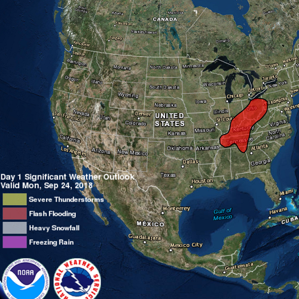

# Display KML

Load and display KML files from various sources, including URLs, local
files, and Portal items.

## How to use the sample

Use the UI to select a source. A KML file from that source will be
loaded and displayed in the map.

## Offline data

Read more about how to set up the sample’s offline data
[here](http://links.esri.com/ArcGISRuntimeQtSamples).

| Link                                                                                           | Local Location                                               |
| ---------------------------------------------------------------------------------------------- | ------------------------------------------------------------ |
| [US State Capitals](https://www.arcgis.com/home/item.html?id=324e4742820e46cfbe5029ff2c32cb1f) | `<userhome>`/ArcGIS/Runtime/Data/kml/US\_State\_Capitals.kml |

## About the data

This sample displays three different KML files:

  - From URL - this is a map of the significant weather outlook produced
    by NOAA/NWS. It uses KML network links to always show the latest
    data.
  - From local file - this is a map of U.S. state capitals. It doesn’t
    define an icon, so the default pushpin is used for the points.
  - From portal item - this is a map of U.S. states.
