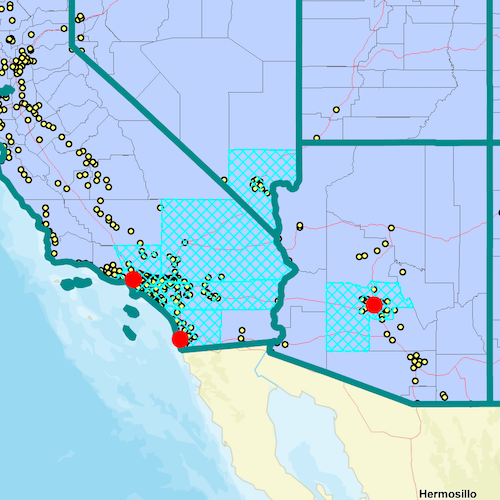

# Query map image sublayer

This sample demonstrates how to execute an attribute and spatial query
on the sublayers of an ArcGIS map image layer.

Sublayers of an `ArcGISMapImageLayer` may expose a `ServiceFeatureTable`
through a `table` getter. This allows you to perform the same queries
available when working with a table from a FeatureLayer: attribute
query, spatial query, statistics query, query for related features, and
so on.

## How to use the sample

  - Launch the sample, the map displays at an extent where individual
    states, counties, and cities can be seen clearly.
  - Provide a numeric value for the population query (values under
    1810000 will produce a selection in all layers).
  - Click the Query in extent button to find all features in the current
    map extent that have a population greater than the value entered.
  - All features (cities, counties, or states) meeting the query
    criteria are selected in the map.
  - Experiment with different map extents and population values and see
    the results.

## How it works

The `ArcGISMapImageLayer` in the map uses the USA map service as its
data source. This service is hosted by ArcGIS Server, and is composed of
four sublayers: states, counties, cities, and highways. The sublayers
(represented by `ArcGISMapImageSublayer`), expose a
`ServiceFeatureTable` through a `table` getter. A query is created to
find features with a population greater than the value provided that are
also in the current map extent. Since the cities, counties, and states
tables all have a POP2000 field, they can all execute the same query.
The features selected by the query are selected in the corresponding
layers to display the results in the map.

## Additional information

An `ArcGISMapImageSublayer` must be loaded before accessing its metadata
or table. Use `ArcGISMapImageLayer::loadTablesAndLayers` to recursively
load all sublayers and tables associated with a map image layer. Some
sublayers do not have an associated table (group layers, for example)
and some may not support specific types of queries. Consult the map
service metadata for details.
