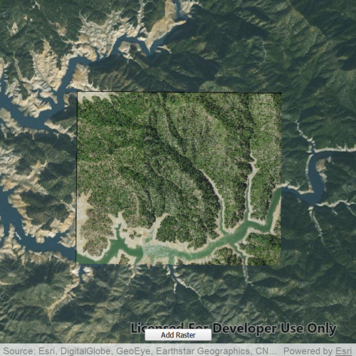

# Raster layer (file)

Demonstrates how to create and use a raster layer made from a local raster file.

## How to use the sample
- The sample will load with a map showing a basemap and a loaded raster layer.
- Tap on the "Add Raster" button to browse for a new raster file.
- On desktop platforms the sample also allows you to drag and drop supported raster files to load.

## How it works
To add a `RasterLayer` as an operational layer from a local raster file:

- Create a `Map` with a `Basemap`. Once this has been loaded, raster layers will be re-projected on the fly to match the map.
- Create a `Raster` from a raster file.
- Create a `RasterLayer` from the raster.
- Add it as an operational layer with `m_map->operationalLayers->append(rasterLayer)`.
- Once the raster layer has been successfully loaded, zoom the map view to an appropriate extent to see it.

## Features
- `Raster`
- `RasterLayer`
- `Basemap`
- `Map`
- `MapQuickView`

## Offline Data
Read more about how to set up the sample's offline data [here](http://links.esri.com/ArcGISRuntimeQtSamples).

Link | Local Location
---------|-------|
|[Shasta.tif raster](https://www.arcgis.com/home/item.html?id=c669445e6cb4490b8306f0c170a9cbb1)| `<userhome>`/ArcGIS/Runtime/Data/raster/Shasta.tif |
