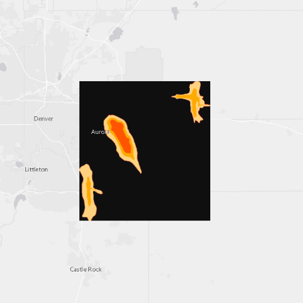

# Raster layer (GeoPackage)

This sample demonstrates how to open a GeoPackage, obtain a raster from the package, and display the table as a RasterLayer.

## How it works
A GeoPackage is created by passing the path to a `.gpkg` file. Once the `Map` loads, `GeoPackage::load` is called. A signal handler is connected so that once the `GeoPackage` loads, the `RasterLayer` can be created. The `RasterLayer` is created by obtaining the first `Raster` in the list of `GeoPackageRasters`, and passing that `Raster` to the `RasterLayer`. Finally, the new layer is appended to the Map's operational layers.

## Features
- GeoPackage
- GeoPackageRaster
- RasterLayer
- Map

## Offline Data
Read more about how to set up the sample's offline data [here](http://links.esri.com/ArcGISRuntimeQtSamples).

Link | Local Location
---------|-------|
|[Aurora, Colorado GeoPackage](https://www.arcgis.com/home/item.html?id=68ec42517cdd439e81b036210483e8e7)| `<userhome>`/ArcGIS/Runtime/Data/gpkg/AuroraCO.gpkg |
