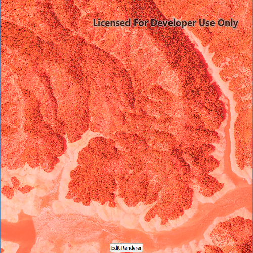

# RGB Renderer

This sample demonstrates how to use rgb renderer on a raster layer.

## How to use the sample
- Tap on the "Edit renderer" button to change the settings for the rgb renderer. 
- The sample allows you to change the stretch type and the parameters for each type. 
- You can tap on the "Render" button to update the raster.

## How it works
- The sample uses an `RGBRenderer` to generate rgb renderers. 
- The settings provided by the user are applied to create a new renderer and the renderer is then set on the raster layer.

## Features
- `Map`
- `MapView`
- `Raster`
- `RasterLayer`
- `RGBRenderer`

## Offline Data
Read more about how to set up the sample's offline data [here](http://links.esri.com/ArcGISRuntimeQtSamples).

Link | Local Location
---------|-------|
|[Shasta.tif raster](https://www.arcgis.com/home/item.html?id=c669445e6cb4490b8306f0c170a9cbb1)| `<userhome>`/ArcGIS/Runtime/Data/raster/Shasta.tif |

