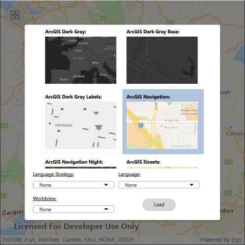

# Create dynamic basemap gallery

Implement a basemap gallery that automatically integrates new customisation options added to the [basemap styles service](https://developers.arcgis.com/rest/basemap-styles/).

## Use case

Multi-use and/or international applications benefit from the ability to change a basemap's style or localize the basemap. For example, an application used by a company that undertakes ecological survey's might include navigation functionality to help guide an ecologist to a location as well as functionality for inputting data and observations made during a survey. When travelling, a user is likely to benefit from a map with a basemap style that emphasizes the transport infrastructure (e.g. `ArcGIS Navigation`). However, when conducting surveys a user is likely to benefit from a map with a basemap that highlights relevant features in the terrain (e.g. `ArcGIS Terrain`). Implementing a basemap gallery in an application gives a user the freedom to select a basemap with a style suitable for the task they are undertaking. Making the basemap gallery dynamic ensures new customisation options are automatically included in the gallery.

## How to use the sample

When launched, this sample displays a basemap and a gallery of previes images for all styles available in the [Basemap Styles Service](https://developers.arcgis.com/rest/basemap-styles/). Selecting a preview image for a style results in the drop-down menus being enabled or disabled depending on whether the customisation option can be applied to the selected style. An inactive drop-down menu indicates that it is not possible to apply that customization to the selected style. Once a style and any desired customizations have been selected, pressing `Load` will update the basemap in the map view.

## How it works

- Instantiate and load a `BasemapStylesService` object.
- Once the `BasemapStylesService` object has loaded successfully, retrieve information about the service contained in the `BasemapStylesServiceInfo` object returned by `BasemapStylesService.info()`.
- Using the `BasemapStylesServiceInfo` object, access the list of `BasemapStyleInfo` objects using `BasemapStylesServiceInfo.stylesInfo()`. The `BasemapStyleInfo` objects contained in the list contains up-to-date information about each of the styles supported by the Maps SDK, including:
  - `styleName`: The human-readable name of the style.
  - `style`: The `BasemapStyle` enumeration value representing this style in the Maps SDK.
  - `thumbnail`: An image that can be used to display a preview of the style.
  - `languages`: A list of `BasemapStyleLanguageInfo` objects, which provide information about each of the specific languages that can be used to customize labels on the style.
  - `worldview`: A list of `Worldview` objects, which rovide information about each representation of a disputed boundary that can be used to customize boundaries on the style.
- The information contained in the list of `BasemapStyleInfo` objects can be used as the data model for a basemap gallery UI component.

## Relevant API

* BasemapStyleInfo
* BasemapStyleLanguageInfo
* BasemapStyleParameters
* BasemapStylesService
* BasemapStylesServiceInfo
* Worldview

## Tags

basemap, languages, service, style,
