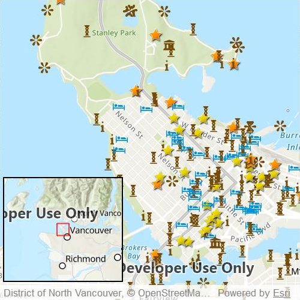

#  Provide context with an Overview Map

Include an overview map in a `MapView` to show the wider context of the view. 

## How to use the sample
Pan and zoom across the `MapView` to browse through the tourist attractions `FeatureLayer`. The tourist attractions layer will only display when the map scale is larger than 1:160,000, so the `OverviewMap` provides a useful overview of the location of the current `MapView` within a wider context. It is also possible to navigate by panning and zooming on the `OverviewMap`.

## How it works
1. Create a `Map` object using an appropriate `Basemap`.
2. Add the `Map` to the `MapView`.
3. Create a `ServiceFeatureTable` from a URL.
4. Instantiate a `FeatureLayer` from the `ServiceFeatureTable` and append it to the `Map`'s operational layers.
5. In the user-interface, declare an `OverviewMap` object from the ArcGIS Runtime Toolkit.
7. Assign the `MapView` to the `geoView` property of the `OverviewMap` to connect the `MapView` with the `OverviewMap`.

## Relevant API
* FeatureLayer
* Map
* MapView
* ServiceFeatureTable

## Additional information
This sample uses [OpenStreetMap Tourist Attraction point data for North America](https://www.arcgis.com/home/item.html?id=97ceed5cfc984b4399e23888f6252856) and the `OverviewMap` toolkit component, which requires the [toolkit](https://github.com/Esri/arcgis-runtime-toolkit-qt) to be cloned and set up locally. For information about setting up the toolkit, see the repository's [root README.md](https://github.com/Esri/arcgis-runtime-toolkit-qt/blob/main/uitools/README.md).

## Tags
context, inset, map, overview, preview, toolkit, view
