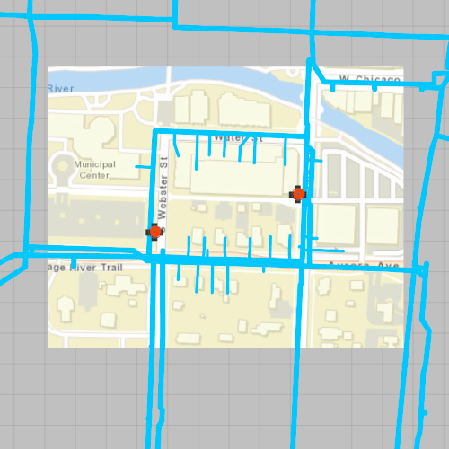

# Generate Offline Map (Overrides)

Take a web map offline with additional options for each layer.

## Use case

When taking a web map offline, you may adjust the data (such as layers or tiles) that is downloaded by using custom parameter overrides. This can be used to reduce the extent of the map or the download size of the offline map. It can also be used to highlight specific data by removing irrelevant data. Additionally, this workflow allows you to take features offline that don't have a geometry - for example, features whose attributes have been populated in the office, but still need a site survey for their geometry.

## How to use the sample

1. Click on "Generate Offline Map (Overrides)".
2. Use the range slider to adjust the min/max levelIds to be taken offline for the Streets basemap.
3. Use the spin-box to set the buffer radius for the streets basemap.
4. Click the buttons to skip the System Valves and Service Connections layers.
5. Use the combo-box to select the maximum flow rate for the features from the Hydrant layer.
6. Use the check-box to skip the geometry filter for the water pipes features.
7. Click "Start Job"
8. Wait for the progress view to indicate that the task has completed.
9. You should see that the basemap does not display when you zoom out past a certain range and is padded around the original area of interest. The network dataset should extend beyond the target area. The System Valves and Service Connections should be omitted from the offline map and the Hydrants layer should contain a subset of the original features.

## How it works

The sample creates a `PortalItem` object using a web map’s ID. This portal item is also used to initialize an `OfflineMapTask` object. When the button is clicked, the sample requests the default parameters for the task, with the selected extent, by calling `OfflineMapTask::createDefaultGenerateOfflineMapParameters`. Once the parameters are retrieved, they are used to create a set of `GenerateOfflineMapParameterOverrides` by calling `OfflineMapTask::createGenerateOfflineMapParameterOverrides`. The overrides are then adjusted so that specific layers will be taken offline using custom settings.

### Streets basemap (adjust scale range)

In order to minimize the download size for offline map, this sample reduces the scale range for the "World Streets Basemap" layer by adjusting the relevant `ExportTileCacheParameters` in the `GenerateOfflineMapParameterOverrides`. The basemap layer is used to contsruct an `OfflineMapParametersKey`object. The key is then used to retrieve the specific `ExportTileCacheParameters` for the basemap and the `levelIds` are updated to skip unwanted levels of detail (based on the values selected in the UI). Note that the original "Streets" basemap is swapped for the "for export" version of the service - see https://www.arcgis.com/home/item.html?id=e384f5aa4eb1433c92afff09500b073d.

### Streets Basemap (buffer extent)

To provide context beyond the study area, the extent for streets basemap is padded. Again, the key for the basemap layer is used to obtain the key and the default extent `Geometry` is retrieved. This extent is then padded (by the distance specified in the UI) using the `GeoemetryEngine::bufferGeodesic` function and applied to the `ExportTileCacheParameters`.

### System Valves and Service Connections (skip layers)

In this example, the survey is primarily concerned with the Hydrants layer, so other information is not taken offline: this keeps the download smaller and reduces clutter in the offline map. The two layers "System Valves" and "Service Connections" are retrieved from the operational layers list of the map. They are then used to construct an `OfflineMapParametersKey`. This key is used to obtain the relevant `GenerateGeodatabaseParameters` from the `GenerateOfflineMapParameterOverrides::generateGeodatabaseParameters` property. The `GenerateLayerOption` for each of the layers is removed from the geodatabse parameters `layerOptions` by checking for the `FeatureLayer::serviceLayerId`. Note, that you could also choose to download only the schema for these layers by setting the `GenerateLayerOption::queryOption` to `GenerateLayerQueryOption::None`.

### Hydrant Layer (filter features)

Next, the hydrant layer is filtered to exclude certain features. This approach could be taken if the offline map is intended for use with only certain data - for example, where a re-survey is required. To achieve this, a whereClause (for example, "Flow Rate (GPM) < 500") needs to be applied to the hydrant's `GenerateLayerOption` in the `GenerateGeodatabaseParameters`. The minimum flow rate value is obtained from the UI setting. The sample constructs a key object from the hydrant layer as in the previous step, and iterates over the available `GenerateGeodatabaseParameters` until the correct one is found and the `GenerateLayerOption` can be updated.

### Water Pipes Dataset (skip geometry filter)

Lastly, the water network dataset is adjusted so that the features are downloaded for the entire dataset - rather than clipped to the area of interest. Again, the key for the layer is constructed using the layer and the relevant `GenerateGeodatabaseParameters` are obtained from the overrides dictionary. The layer options are then adjusted to set `useGeometry` to false.

Having adjusted the `GenerateOfflineMapParameterOverrides` to reflect the custom requirements for the offline map, the original parameters and the custom overrides, along with the download path for the offline map, are then used to create a `GenerateOfflineMapJob` object from the offline map task. This job is then started and on successful completion the offline map is added to the map view. To provide feedback to the user, the progress property of `GenerateOfflineMapJob` is displayed in a window.

## Relevant API

* ExportTileCacheParameters
* GenerateGeodatabaseParameters
* GenerateLayerOption
* GenerateOfflineMapJob
* GenerateOfflineMapParameterOverrides
* GenerateOfflineMapParameters
* GenerateOfflineMapResult
* OfflineMapParametersKey
* OfflineMapTask

## Additional information

For applications where you just need to take all layers offline, use the standard workflow (using only `GenerateOfflineMapParameters`). For a simple example of how you take a map offline, please consult the "Generate offline map" sample.

## Tags

adjust, download, extent, filter, LOD, offline, override, parameters, reduce, scale range, setting
