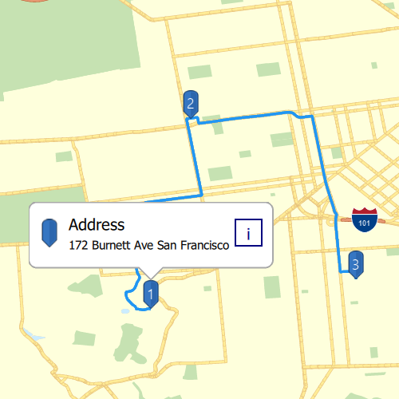

#Mobile map (search and route)

This sample demonstrates how to geocode and route using data in a map package. After selecting a map, if geocoding is available, click on the MapView to reverse geocode stops. After there are at least two geocoded stops, if routing is available, click on the route button to solve the route.

##How it works
A `QDir` is created using a dedicated folder, and `MobileMapPackage`s are created using the `.mmpk` files contained in that directory. `These MobileMapPackages` are stored in a `QList` for future access. When a `Map` inside the package is selected, geocoding is performed using the package's `locatorTask`, and a `RouteTask` is created using its `transportationNetworks`. The logic for the geocoding and routing is similar to the "Offline geocode" and "Find a route" samples. The results are visually displayed with `GraphicsOverlay`s and a `Callout`. 

##Features
- Map
- MapView
- MobileMapPackage
- RouteTask
- RouteParameters
- RouteResult
- Stop
- LocatorTask
- GeocodeResult
- ReverseGeocodeParameters
- Graphic
- GraphicsOverlay
- PictureMarkerSymbol
- SimpleLineSymbol
- TextSymbol
- SimpleRenderer
- Callout

##Offline Data
Read more about how to set up the sample's offline data [here](http://links.esri.com/ArcGISRuntimeQtSamples).

Link | Local Location
---------|-------|
|[Yellowstone mmpk File](https://www.arcgis.com/home/item.html?id=e1f3a7254cb845b09450f54937c16061)| `<userhome>`/ArcGIS/Runtime/Data/mmpk/Yellowstone.mmpk |
|[SanFrancisco mmpk File](https://www.arcgis.com/home/item.html?id=133ae60b710b4d29bec40fbbebb136ab)| `<userhome>`/ArcGIS/Runtime/Data/mmpk/SanFrancisco.mmpk |
