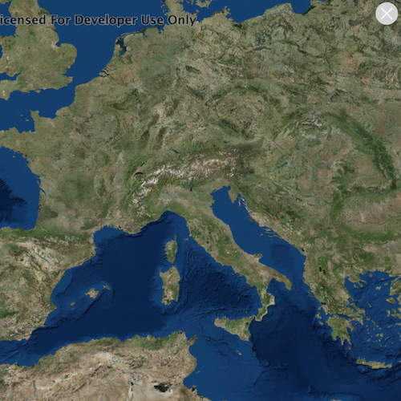

# Take screenshot

This sample demonstrates how to take a screenshot of the MapView. This
could be useful for sending an image of your map to a coworker, or it
could be used for testing and debugging your applications. This same
workflow works with the 3D SceneView as well.

## How to use the sample

Open the sample and navigate to a desired location on the map. Press the
`Take screenshot` button, and a screenshot image will display over the
map. You can close the image by pressing the close button. Continue
navigating the map and generating new screenshots.

## How it works

  - The `exportImage` function is executed on the `MapView`.
  - Once the asynchronous task completes, a `QImage` is returned.
  - QML cannot directly render a `QImage`. Instead, a QML Image Provider
    must be created for generating an in-memory URL to the returned
    `QImage`. This is done with the following steps:
  - Subclass `QQuickImageProvider`.
  - Reimplement the `requestImage` function.
  - Add an image provider to the `QQmlEngine` instance using
    `QQmlEngine::addImageProvider`.
  - Create a `Q_PROPERTY` that returns the image URL from the Image
    Provider.
  - Bind the QML Image to the image URL property. When this property
    changes, it will automatically trigger the `requestImage` function
    and return the URL to the image.
