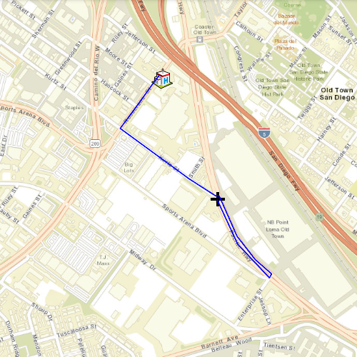

# Closest facility

This sample demonstrates how to solve a Closest Facility Task to find the closest route between a facility (hospital) and an incident (black cross).

## How to use sample
Click near any of the hospitals and a route will be displayed from that clicked location to the nearest facility.

## How it works
To display a `ClosestFacilityRoute` between an `Incident` and a `Facility`:

1. Create a `ClosestFacilityTask` using an Url from an online service.
2. Get a `ClosestFacilityParameters` from this task, using `createDefaultParameters`.
3. Add a list of facilities to the task parameters, using `ClosestFacilityParameters::setFacilities(const QList<Facility>& facilities);`.
4. Add an incident to the parameters, using `ClosestFacilityParameters::setIncidents(const QList<Incident>& incidents);`.
5. Get the `ClosestFacilityResult` from solving the task with parameters: , `ClosestFacilityTask::solveClosestFacility(const ClosestFacilityParameters& closestFacilityParameters);`.
6. Get the ranked list of the indices of the closest facilities to the incident, `ClosestFacilityResult::rankedFacilities(int incidentIndex) const;`.
7. Get the index of the closest facility (e.g. the first index in the ranked list).
8. Find the closest facility route, `ClosestFacilityResult::route(int facilityIndex, int incidentIndex) const;`.
9. Display the route on the `MapView`:
 - create a `Graphic` from the route geometry, `new Graphic(route.routeGeometry(), this)`.
 - add graphic to `GraphicsOverlay` which is attached to the mapview.

## Features
- `ClosestFacilityTask`
- `ClosestFacilityParameters`
- `ClosestFacilityResult`
- `Facility`
- `Incident`
