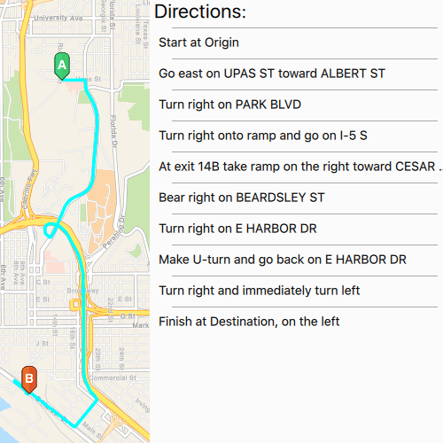

#Find route

This sample demonstrates how to get a route between two locations.

##How it works

For simplicity, the sample comes loaded with a start and end stop. You can tap on the route button to get a route between these stops. Once the route is generated, the directions button gets enabled. Tap on the button to see the step by step directions for the route.

The sample uses the `generateDefaultParameters` method on `RouteTask` to get the default parameters from the service. Next, the stops are set in those parameters and returnDirections is set to true. Then, the `solveRoute` method is used to solve for the route. Once the route has been solved, the sample displays the route as a `Graphic`, and the `directionManeuvers` are given to a ListView.

##Features
- MapView
- Map
- Basemap
- GraphicsOverlay
- Graphic
- Point
- PictureMarkerSymbol
- SimpleLineSymbol
- SimpleRenderer
- RouteTask
- RouteParameters
- Stop
- RouteResult
- DirectionManeuverListModel
