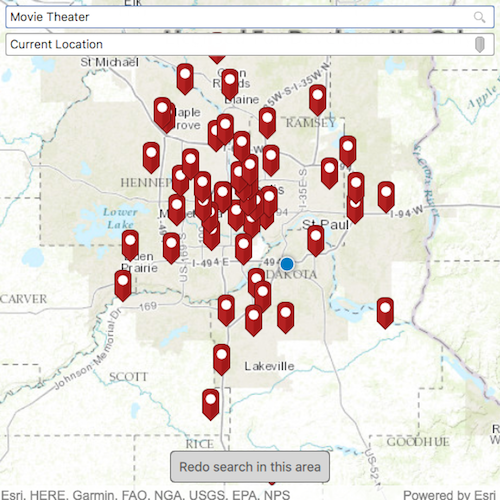

# Find a place

This sample demonstrates how to use geocode functionality to search for
points of interest around a location or within an extent.

## How it works

Two text boxes allow you to input a point of interest (such as “Movie
Theater”, “Starbucks”, or “Park”), as well as a location. Setting a
location will set the preferred search location, so that geocode results
closer to that location are preferred. Optionally, tap the pin symbol in
the text box to search near your current location. When you pan the map
and change the current viewpoint, a button will appear, allowing you to
search the current map extent for a place of interest.

This workflow is accomplished by creating a `LocatorTask` with the URL
to the World Geocoding Service. Suggestions are obtained by setting the
locator’s suggestion `searchText` from the text boxes. “POI” and
“Populated Place” categories are set on the `SuggestionParameters` so
that the suggestions that are returned for each text box make sense.
Once a suggestion is selected or enter is hit on the keyboard,
`geocodeWithParameters` is called. The `GeocodeParameters` sets the
`preferredSearchLocation`, so that results near this location are
preferred. If the button to search within an extent is clicked, the
`searchArea` property is set to the MapView’s current viewpoint. Search
area differs from preferred search location because it only shows
results within the search area, whereas the preferred search area only
prefers closer results over further results. Once the geocode completes
successfully, a `Graphic` is created for each `GeocodeResult`, and is
added to a `GraphicsOverlay` for display on the Map.
