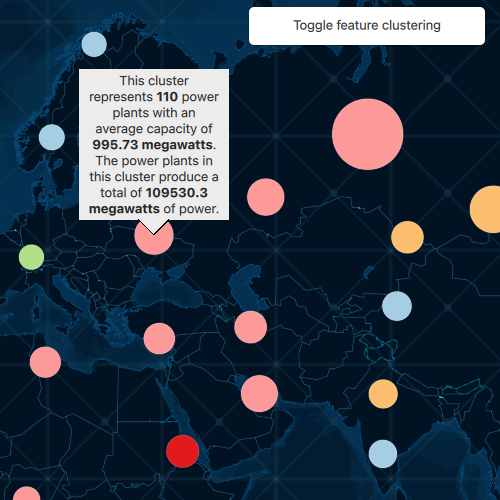

# Display points using clustering feature reduction

Display a web map with a point feature layer that has feature reduction enabled to aggregate points into clusters.

## Use case

Feature clustering can be used to dynamically aggregate groups of points that are within proximity of each other in order to represent each group with a single symbol. Such grouping allows you to see patterns in the data that are difficult to visualize when a layer contains hundreds or thousands of points that overlap and cover each other.

## How to use the sample

Pan and zoom the map to view how clustering is dynamically updated. Toggle clustering off to view the original point features that make up the clustered elements. When clustering is On, you can click on a clustered geoelement to view aggregated information and summary statistics for that cluster. When clustering is toggled off and you click on the original feature you get access to information about individual power plant features.

## How it works

1. Load a web map by constructing a Map with a `PortalItem`.
2. Get the cluster enabled layer from the map's operational layers.
3. Get the `FeatureReduction` from the feature layer and set the `enabled` property to enable or disable clustering on the feature layer.
4. When the user clicks on the map, call `identifyLayer` on the feature layer and pass in the map click location and additional parameters. Calling `identifyLayer` will update the map view's `identifyLayerResult` property. 
5. When `identifyLayer` completes, get the `Popup` from the resulting `IdentifyLayerResult` and use it to construct a `PopupManager`.
6. Get the feature's `customHtmlDescription` from the created `PopupManager` and use it to set the MapView's `CalloutData` detail and display the callout.

## Relevant API

- AggregateGeoElement
- FeatureLayer
- FeatureReduction
- GeoElement
- IdentifyLayerResult

## About the data

This sample uses a [web map](https://www.arcgis.com/home/item.html?id=8916d50c44c746c1aafae001552bad23) that displays the Esri [Global Power Plants](https://www.arcgis.com/home/item.html?id=eb54b44c65b846cca12914b87b315169) feature layer with feature reduction enabled. When enabled, the aggregate features symbology shows the color of the most common power plant type, and a size relative to the average plant capacity of the cluster.

## Tags

aggregate, cluster, group, merge, normalize, summarize, bin, reduce
