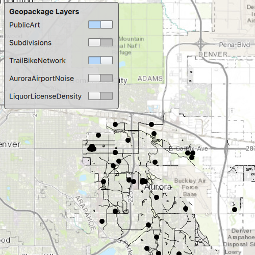

# Read GeoPackage

This sample demonstrates how to read rasters and feature tables from geoPackages to show them as layers in a map.

## How to use the sample
Use the top-left menu to select individual geopackage layers to add to the map. Unselect them to remove them.

## How it works
1. Create an empty menu UI using QML, along with empty `listView` and `listModel` objects.
2. Create a `GeoPackage` QML object within the `listView` and load it locally, or download if remote.
3. Iterate through the geopackage, once for the `featureTables` layers and once for the `raster` layers. In each iteration, create an `ArcGISRuntime` Object that constructs the appropriate layer.
4. Still within the iteration, create a JSON object that has a `lyr` (layer) property and a `name` (name) key, both set to the corresponding `ArcGISRuntime` object values. Append these to the `listModel`.
5. Within `listView`, but outside of the iterator, create a `delegate` that takes `listModel` as a `model`.
6. For each `Item` in the `model`, create a row and a switch within that, when `checked`, appends the current `lyr` `Item` to the `map`'s `operationalLayers`.

## Relevant API
 - listView
 - listModel
 - GeoPackage
 - delegate
 - Switch

## Tags
GeoPackage, Maps, data, UI, listView
